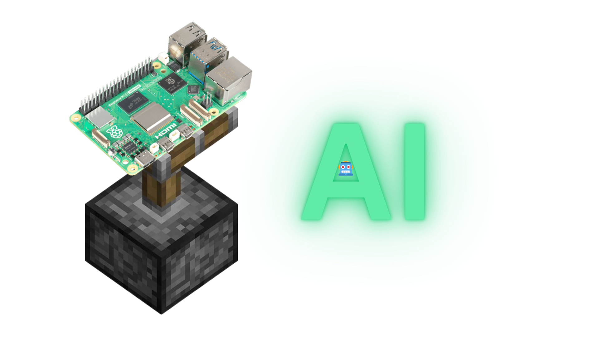

# Piston AI
A voiced AI assistant that makes life easier with the power of IoT!!

## Features

- **Wake Word Detection** -- Say "Hey Piston" to activate listening (powered by [openwakeword](https://github.com/dscripka/openwakeword))
- **Speech-to-Text** -- Real-time voice transcription using [faster-whisper](https://github.com/SYSTRAN/faster-whisper) (Whisper `base.en`)
- **Text-to-Speech** -- J.A.R.V.I.S.-style voice responses via [Piper TTS](https://github.com/rhasspy/piper) with a custom ONNX voice model
- **Tool/Function Calling** -- The LLM can call tools to interact with the real world (weather, web search, media control, clipboard, system health, YouTube Music)
- **Chat History** -- Conversations are persisted as JSON files in `userdata/chats/`
- **Swappable LLM Backends** -- Supports [Ollama](https://ollama.com) (local) and NVIDIA (cloud) via [litellm](https://github.com/BerriAI/litellm) (More providers will be rolled out in the future)

## Prerequisites

- **Python 3.11+**
- **Ollama** installed and running locally (Please install Ollama manually on Windows)
- **Microphone access** required for voice mode

## Installation

```bash
python3 setup.py
```

To skip package installation (if you want to skip to configuration):
```bash
python3 setup.py --skip-installation
```


The interactive setup will:
1. Detect your OS and install system dependencies (Ollama, xclip, xdotool on Linux; Ollama via Homebrew on macOS)
2. Install Python packages from `requirements.txt`
3. Prompt you to select an LLM provider (Ollama or NVIDIA) and model
4. Save configurations to `userdata/config.json` and `.env`

## Usage

### Voice Mode (default)

```bash
python3 main.py
```

Say **"Hey Piston"** to wake the assistant, then speak your request. Piston will respond with a voiced J.A.R.V.I.S.-style answer.

Use `-m` for **manual mode** (press Enter to trigger listening instead of using the wake word):

```bash
python3 main.py -m
```

### CLI Mode

A text-based REPL for development or when no microphone is available:

```bash
python3 term.py
```

Resume a previous conversation:

```bash
python3 term.py
```

## Available Tools

Piston can call the following tools through LLM function calling:

| Tool                    | Description                                 |
|-------------------------|---------------------------------------------|
| `fetchWeather`          | Real-time weather by geolocation            |
| `webSearch`             | DuckDuckGo web search                       |
| `healthCheck`           | CPU, memory, disk, battery usage            |
| `systemSpecs`           | OS, CPU model, memory/disk size             |
| `connectivityCheck`     | Network and Bluetooth status                |
| `fullCheck`             | Combined health + specs + connectivity      |
| `readTextFromClipboard` | Read clipboard contents                     |
| `writeTextToClipboard`  | Write text to clipboard                     |
| `playSong`              | Search and play on YouTube Music via yt-dlp |
| `playpauseMedia`        | Toggle media play/pause                     |
| `nexTrack`              | Skip to next track                          |
| `previousTrack`         | Return to previous track                    |
| `fetchCurrentPlaying`   | Returns the current playing media           |

## Configuration

- Provider and model settings are stored in `userdata/config.json`
- API keys are stored in `.env` (e.g., `NVIDIA=your_api_key_here`)
- Models (wake word, TTS voice, LLM) are auto-downloaded on first run if missing
